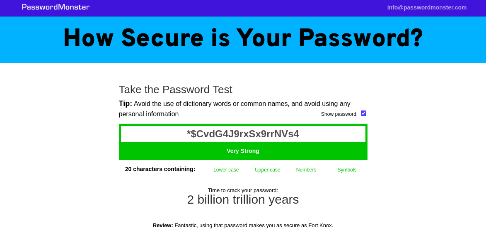

# QuickSafe Password Generator

Generate strong and secure passwords with QuickSafe Pass, an open-source password generator. Protect your accounts with diverse character sets.

## Table of Contents

- [Introduction](#introduction)
- [Features](#features)
- [Getting Started](#getting-started)
  - [Prerequisites](#prerequisites)
  - [Installation](#installation)
- [Usage](#usage)
- [Frequently Asked Questions](#frequently-asked-questions)
- [License](#license)
- [Acknowledgements](#acknowledgements)
  

## Introduction

Enhance your online security effortlessly with QuickSafe, an open-source password generator. Create robust passwords featuring diverse character sets, including uppercase letters, lowercase letters, numbers, symbols, and more. Improve your password strength with our tool, ensuring strong protection for your accounts.

## Checking Password Strength

You can use various online tools to check the strength of passwords generated by QuickSafe. Here's a simple guide:

1. **Generate a Password:**
   - Use QuickSafe to generate a password. Click on the "Generate Password" button or use the provided input field.

2. **Copy the Password:**
   - Once the password is generated, click on the copy button next to the password input field.

3. **Check Strength:**
   - Visit an online password strength meter tool of your choice (e.g., [PasswordMeter](https://www.passwordmeter.com/), [How Secure Is My Password](https://howsecureismypassword.net/), etc.).

4. **Paste and Analyze:**
   - Paste the copied password into the strength meter and analyze the results.

The passwords generated by QuickSafe are designed to be strong and secure, incorporating diverse character sets. Feel free to test their strength using your preferred password strength meter.

## Features

- Generate strong and secure passwords
- Customizable character sets
- Open-source and free to use
- No server-side storage of generated passwords

## Getting Started

### Prerequisites

- Web browser
- Internet connection

### Installation

No installation is required. Visit the [QuickSafe Password Generator](https://yashgawande546.github.io/Quick-Safe/) website to generate passwords.

## Usage

1. Visit the [QuickSafe Password Generator](https://yashgawande546.github.io/Quick-Safe/) website.
2. Customize your password preferences.
3. Click on the "Generate Password" button.
4. Copy the generated password to use.

## Frequently Asked Questions

### Do we store the passwords generated by this site?

No, the passwords aren't created on our servers. They are created locally on your machine, ensuring privacy and security.

### Is this an open-source project?

Yes, QuickSafe is an open-source project. You can find the source code on our [GitHub repository](https://github.com/yashgawande546/Quick-Safe/).

### Is the password generator free to use?

Absolutely! QuickSafe is completely free to use, and you can generate strong passwords without any cost.

### Is it safe to use this password generator?

Yes, the password generator is designed to be safe and secure. Your passwords are generated locally, ensuring your privacy and security.

## License

This project is licensed under the [MIT License](https://github.com/yashgawande546/Quick-Safe/blob/main/LICENSE) - see the [LICENSE.md](https://github.com/yashgawande546/Quick-Safe/blob/main/LICENSE) file for details.

## Acknowledgements

- [Tailwind CSS](https://tailwindcss.com/) - A utility-first CSS framework.
- [Material Design Icons](https://material.io/resources/icons/) - Material Design icons by Google.

With ❤️ by Yash Gawande

